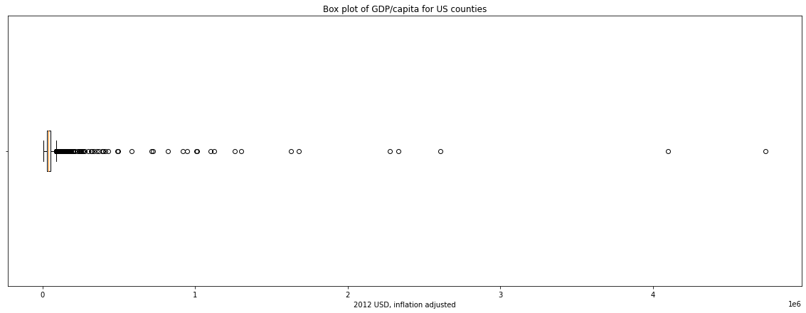

# GDPperCapita
 Finding the GDP/capita of every county in the US

 # Data
 1. GDP per U.S. county: [Link to Data](https://www.bea.gov/data/gdp/gdp-county-metro-and-other-areas)
 2. Population per U.S. county: [Link to Data](https://www.census.gov/programs-surveys/popest/technical-documentation/research/evaluation-estimates/2020-evaluation-estimates/2010s-counties-total.html)

  # Process

  We import the 2 datasets into a python notebook, and join them on the value "FIPS code".

  Then we divide GDP/Population of each county to get GDP/capita.

  # Results:
Real GDP/capita in 3190 US Counties are exported to a file called `US_Counties_GDP_per_Capita.csv`

Mean GDP/capita of all counties:  $73,561.71
Median GDP/capita of all countries:  $38,126.17

```
Left Whisker :  $-8997.912035664762
Q1 quantile of GDP/capita :  $27628.48383138619
Q3 quantile of GDP/capita :  $52046.081076086826
Right Whisker :  $88672.47694313778
```


